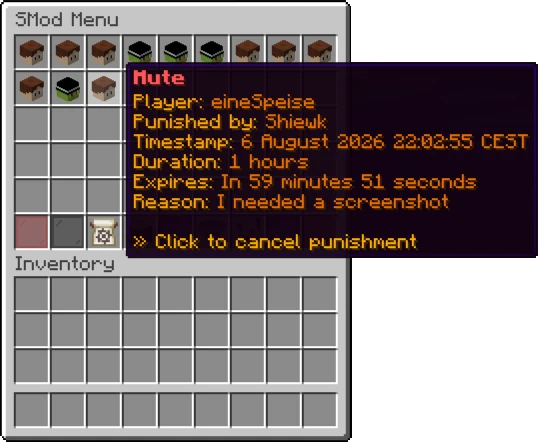
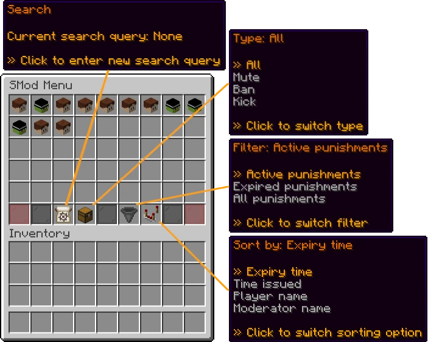

# SModeration

**An easy-to-use Minecraft plugin for moderating your server.**

SModeration can be used to mute, ban, and kick players that break the rules while providing a nice interface to your moderators.
It keeps track of all punishments to ensure that you get a complete overview of every rule violation on your server.

The plugin also includes many useful server management commands like vanish and invsee/ecsee.

## What can the plugin actually do? (feature list)

- Punishments (mute, kick, ban and [custom ones](docs/custom-punishments.md)), both temporary and permanent
- Punishment management using [commands](docs/commands.md) and the [inventory menu](#the-smod-menu)
- Viewing and modifying players' inventories and ender chests (/invsee, /ecsee)
- Vanish mode (/vanish)
- SocialSpy (/socialspy)
- [Permission checks](docs/custom-punishments.md)

Additionally, the following features can be configured in the [plugin's config](src/main/resources/default-config.yml):

- Enabling/disabling certain plugin features
- Simple Voice Chat mute integration
- Discord webhook integration
- Color customization
- Modifying translations
- Requiring reasons for all punishments
- [Custom punishment types](docs/custom-punishments.md)

## The SMod menu

**The SMod menu** is an inventory menu for managing and viewing punishments on your server:

Open it with /smod, or [disable it](src/main/resources/default-config.yml) if you don't need it.

## All commands

For a complete list, please see the [command list](docs/commands.md).

## Permissions

This plugin uses Bukkit permissions for commands and other actions.
For a list of permissions, please see [the permissions documentation](https://github.com/Shiewk/SModeration/blob/main/docs/permissions.md).